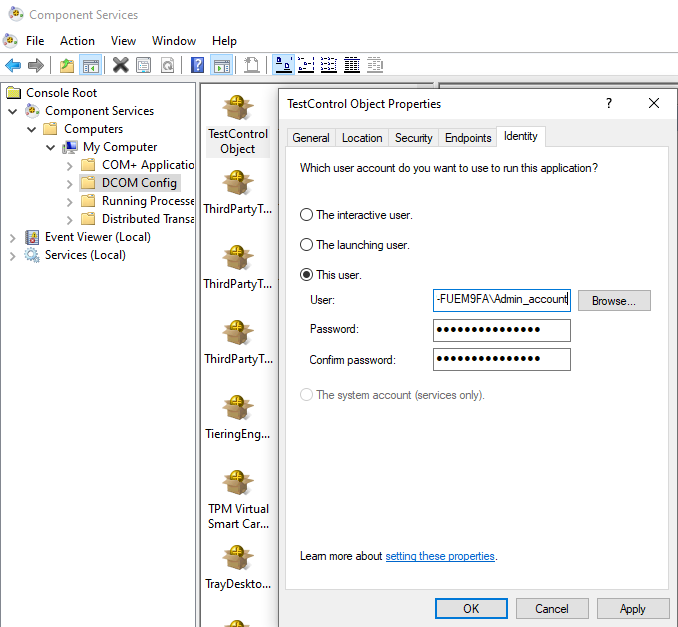

## How to configure COM servers to always run as admin _with_ UAC

Read [COM Elevation Moniker](https://docs.microsoft.com/en-us/windows/win32/com/the-com-elevation-moniker) for instructions for how to use User Account Control (UAC) prompts to request admin privileges for a COM server. UAC is general is documented in [How User Account Control works](https://docs.microsoft.com/en-us/windows/security/identity-protection/user-account-control/how-user-account-control-works) Also need to explicitly call `CoInitializeSecurity` in the COM server to enable low privilege clients to connect.

Instructions:
* Build solution from Visual Studio started with admin privileges.
* To test, run `RunInSandbox.exe hi TestControl.TestControl` from a non-admin command prompt. This will trigger a UAC prompt (if UAC is enabled) before the COM server is started. The UAC prompt will require a password _if_ the current user is not an admin.

   

## How to configure COM servers to always run as admin _without_ UAC

**WARNING**: This will introduce a privilege escalation vulnerability if not used carefully.

The [`HKCR\AppID\{APPID}\RunAs`](https://learn.microsoft.com/en-us/windows/win32/com/runas) registry value can be used to configure which user account is used for out-of-proc COM servers. This can be used to make a COM server always run with admin privileges without any UAC prompt.

Alternatives for editing the registry value:
* Edit registry with `regedit.exe`. This only works for accounts that doesn't require a password.
* Use `ComRunAs.exe` tool in this repo to specify username & password.
* Edit manually using `Component Services` (`dcomcnfg.exe`).
  

In order to be compatible with RunAs, elevated COM servers need to explicitly call `CoInitializeSecurity` in the COM server to enable lower privilege clients to connect. The assigned user also need to have sufficient filesystem permissions to start the server.

### Instructions to test
* From the Windows registry, set the `RunAs` registry value to `nt authority\localservice` or some other admin account.
* Verify that the account have sufficient filesystem permissions to run the COM server.
* To test, run `RunInSandbox.exe TestControl.TestControl` from a limited account. This will trigger creation of a TestControl.exe under the specified account with a COM communication channel between the processes.

CoCreateInstance calls from non-admin accounts will now start the COM server using an admin account.
